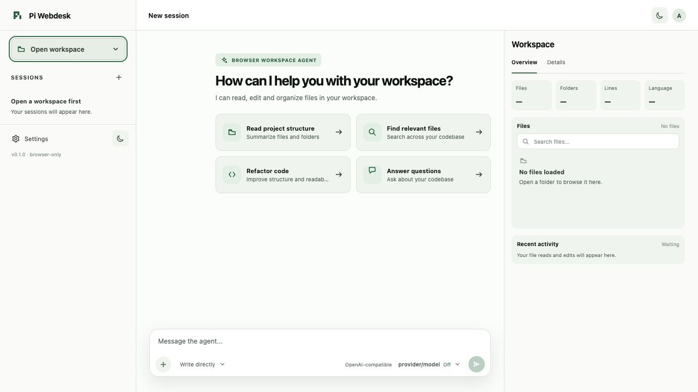
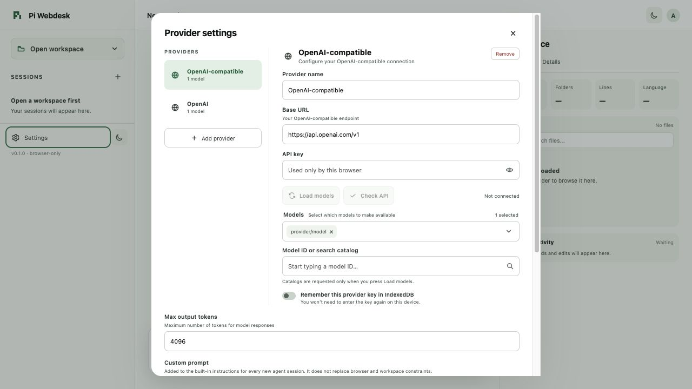
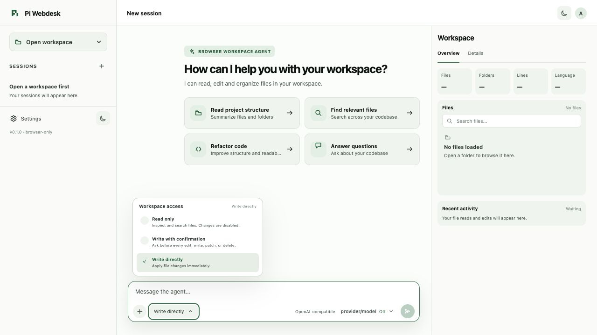
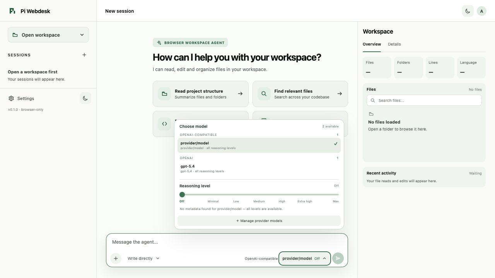

# Pi Webdesk

Pi Webdesk is a browser-only coding agent for local workspaces. It runs in a desktop browser, connects directly to an OpenAI-compatible API, and lets you inspect, search, and edit a folder you explicitly choose.

> Early-stage software (`v0.1.0`). The browser-only architecture is intentional: there is no backend, shell, or local server in the product.

## Screenshots

<p align="center">
  
  
</p>
<p align="center">
  
  
</p>

## What it does

- Runs the Pi agent runtime in the browser.
- Sends requests directly to the configured OpenAI-compatible Chat Completions endpoint with streaming responses.
- Opens a local project folder through the File System Access API.
- Provides browser-native tools for `read`, `ls`, `find`, `grep`, `edit`, `write`, `apply_patch`, and `delete`.
- Supports multiple providers, model catalogs, and per-request reasoning levels.
- Stores settings, sessions, and saved folder handles in IndexedDB. API keys are persisted only when you enable the provider-level **Remember** option.
- Offers three workspace access modes: read only, write with confirmation, and write directly.

## Requirements

- Node.js `^20.19.0` or `>=22.12.0` for the development toolchain.
- Desktop Chrome or Edge 120+ for local folder access.
- An OpenAI-compatible API endpoint that is reachable over HTTPS and allows CORS requests from the app origin.

Safari and Firefox are not part of the current support target because the app depends on `showDirectoryPicker()` for selecting an arbitrary local folder.

## Development

Install dependencies and start the Vite development server:

```bash
npm install
npm run dev
```

Open the local URL printed by Vite. Then:

1. Open **Settings** and add a provider, base URL, API key, and model.
2. Click **Open workspace** and choose a project folder.
3. Select the workspace access mode that fits the task.
4. Send a request or use one of the starter actions.

## Configuration

Provider settings support any API with an OpenAI-compatible Chat Completions interface. You can configure:

- provider name and base URL;
- API key, with optional browser-only persistence;
- one or more model IDs, entered manually or loaded from the provider catalog;
- maximum output tokens;
- a custom prompt appended to the built-in browser/workspace instructions;
- the keyboard shortcut used to send messages.

The configured provider must allow the browser app's origin in its CORS policy. Pi Webdesk cannot bypass CORS or mixed-content restrictions.

## Workspace access

| Mode | Behavior |
| --- | --- |
| **Read only** | Inspect and search files; changes are disabled. |
| **Write with confirmation** | Ask before every edit, write, patch, or delete. |
| **Write directly** | Apply file changes immediately. |

The agent can access only the folder selected through the browser picker. It does not receive arbitrary absolute paths.

## Production build and deployment

Build the static site:

```bash
npm run build
```

Deploy the contents of `dist/` to any static HTTPS host. No backend, WebSocket server, database, or separate runtime is required after the build. The API endpoint still needs to allow CORS from the deployed site origin.

## Verification

```bash
npm run typecheck
npm test
npm run build
```

## Deliberate limitations

Because the product runs entirely in a browser, it cannot:

- run shell commands, Git, tests, builds, or other local processes;
- watch external file changes with a native file watcher;
- work with paths outside the selected workspace;
- continue running after the page is closed.

Run project commands separately in a local terminal.

## Built on Pi

Pi Webdesk is based on [Pi](https://github.com/earendil-works/pi), created by Mario Zechner and contributors. Thank you to the Pi project for the agent runtime and its small, composable foundation.

This project uses `@earendil-works/pi-agent-core` and `@earendil-works/pi-ai`, then adapts the Pi workflow to browser-only workspace access. Pi Webdesk is not the original Pi distribution; see [NOTICE.md](NOTICE.md) for attribution and third-party notices.

## Project structure

See the more detailed [architecture description](docs/architecture.md) for the runtime flow, browser boundaries, and persistence model.

```text
src/
├── agent/        Pi runtime adapter and OpenAI-compatible fetch
├── app/          React UI, state, sessions, and routing
├── filesystem/   File System Access API workspace layer
├── persistence/  IndexedDB settings, workspaces, and sessions
├── tools/        Browser-native file tools
└── workers/      Background file search
```

## License and notices

Third-party attribution and license information is collected in [NOTICE.md](NOTICE.md). The repository does not include the original Pi distribution; it uses the published Pi packages listed above.
